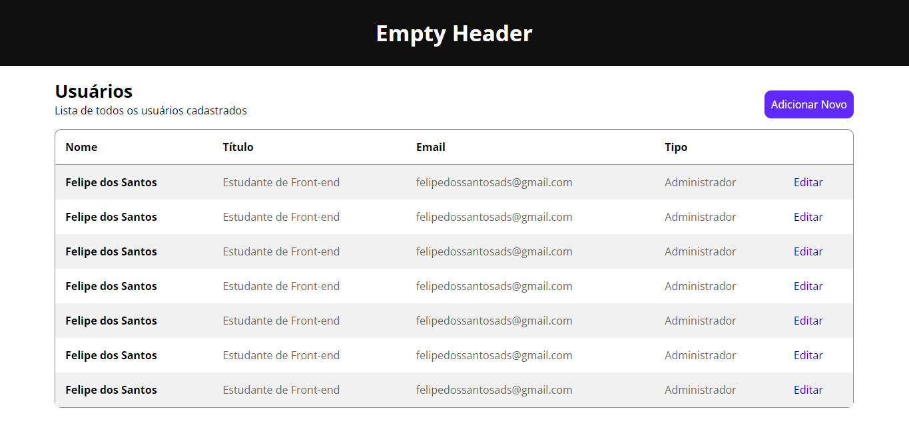

## A páginas estão dentro da pasta html

## Print table list page:
<<<<<<< HEAD

=======
>>>>>>> 1ba301cc71ff96cd7ef3cfc7cb63be269ade32c6
#### 1366x768px screen

#### 1920x1080px screen

## Print login page:
#### 1366x768px screen

#### 1920x1080px screen

#### 375x667px screen

